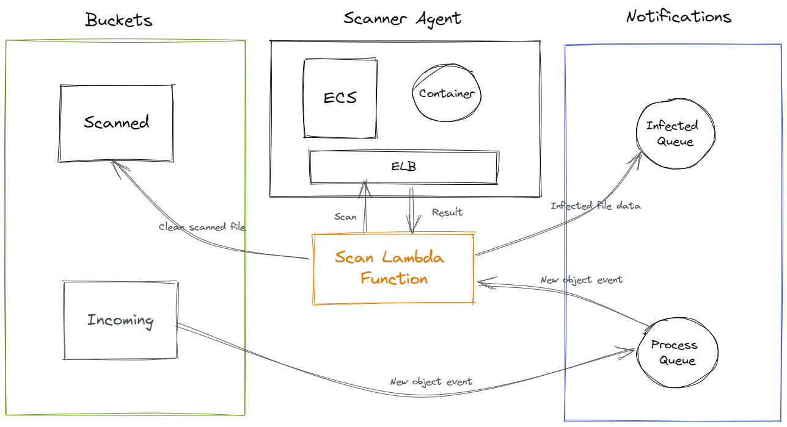

# S3 Antivirus Scanner

This project creates antivirus scanner for S3 bucket object. 

## The Design



## Antivirus / Scanner

The project uses an open source antivirus called [ClamAV](https://www.clamav.net/) from Cisco. The antivirus is place in the scanner agent container which can be called or triggered via API. 

The docker image of the scanner agent can be found from the following repo...

[Scanner Agent Docker Image](https://hub.docker.com/repository/docker/gamemasterdev/clamav)

```shell

docker pull gamemasterdev/clamav

```

## Getting Started

Install all dependencies

```bash

npm install

```

## Building The Project

The project consist of 2 service components...
1. Lambda Function
2. Scanner Agent API

To build them all at once, simply run the following...

```bash

npm run build

```

To build only the `Lambda Function`, run the following...

```bash

npm run build-api

```

To build only the `Scanner Agent API`, run the following...

```bash

npm run build-agent

```

## Building the Docker Image

The scanner agent and its API are loaded into container where the image comes from docker. 

You can build the image by running the following...

```bash

docker build -t <image name>:<version> .

```