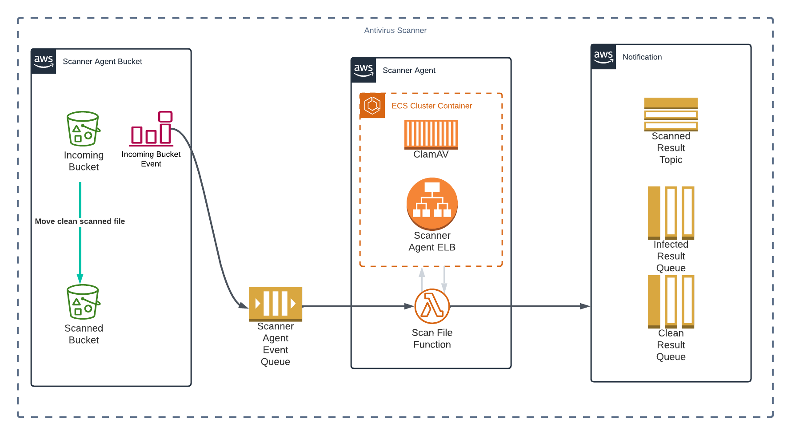

# S3 Antivirus Scanner

This project demostrates and creates antivirus scanner for objects going into AWS S3 Buckets.

## The Design

1. Default configuration
   - This configuration uses 2 buckets created under the custodianship of the Scanner



2. Custom bucket configuration
   - This configuration is for custom buckets setup where the bucket(s) ownership is/are not under the Scanner


3. Custom bucket as scanned destination configuration
   - This configuration uses the Scanner incoming bucket to receive object to be scanned and then tranfers it to the custom destination bucket not owned by the Scanner


## Antivirus / Scanner

The project uses an open source antivirus called [ClamAV](https://www.clamav.net/) from Cisco. The antivirus is place in the scanner agent container which can be called or triggered via API.

The docker image of the scanner agent can be found from the following repo...

[Scanner Agent Docker Image](https://hub.docker.com/repository/docker/gamemasterdev/clamav)

```shell

docker pull gamemasterdev/clamav

```

## Getting Started

Install all dependencies

```bash

npm install

```

## Setting up which configuration to use

As explained in the beginning of the [documentation](#the-design), there are `3` configuration options to choose from. In order to setup the infra to use any one of the above, the CDK context config needs to be as follows:

1. Default configuration

```json
{
  "incomingBucketArnList": null,
  "defaultIncomingBucket": true,
  "defaultInfectedBucket": false
}
```

2. Custom bucket configuration

```json
{
  "incomingBucketArnList": [
    "arn:aws:s3:::somebucket-1",
    "arn:aws:s3:::somebucket-2",
    "arn:aws:s3:::somebucket-3"
  ],
  "defaultIncomingBucket": false,
  "defaultInfectedBucket": true
}
```

3. Custom bucket as scanned destination configuration

```json
{
  "incomingBucketArnList": [
    "arn:aws:s3:::somebucket-1",
    "arn:aws:s3:::somebucket-2",
    "arn:aws:s3:::somebucket-3"
  ],
  "defaultIncomingBucket": true,
  "defaultInfectedBucket": false
}
```

## Building The Project

The project consist of 2 service components...

1. Lambda Function
2. Scanner Agent API

To build them all at once, simply run the following...

```bash

npm run build

```

To build only the `Lambda Function`, run the following...

```bash

npm run build-api

```

To build only the `Scanner Agent API`, run the following...

```bash

npm run build-agent

```

## Building the Docker Image

The scanner agent and its API are loaded into container where the image comes from docker.

You can build the image by running the following...

```bash

docker build -t <image name>:<version> .

```
